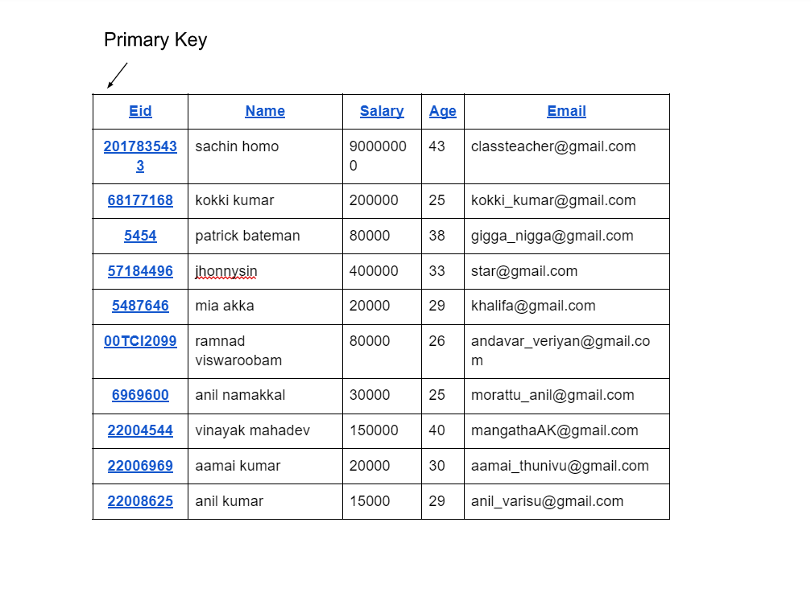
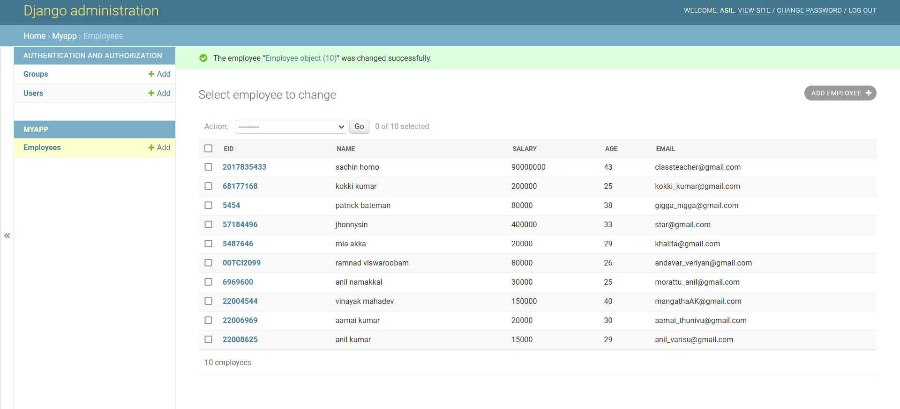

# Django ORM Web Application

## AIM
To develop a Django application to store and retrieve data from a database using Object Relational Mapping(ORM).

## Entity Relationship Diagram


## DESIGN STEPS

### STEP 1:
change the directory to the name of the repository cloned
$ cd dataproject

### STEP 2:
create a new app
$python3 manage.py startapp myapp

### STEP 3:
inform git that you want to include updates to a particular file in the next comment
$git add -A

## PROGRAM
```
admin.py

from django.contrib import admin
from .models import Employee,EmployeeAdmin
admin.site.register(Employee,EmployeeAdmin)

model.py

from django.db import models
from django.contrib import admin
class Employee (models.Model):
    eid=models.CharField(max_length=20,help_text="Employee ID")
    name=models.CharField(max_length=100)
    salary=models.IntegerField()
    age=models.IntegerField()
    email=models.EmailField()

class EmployeeAdmin(admin.ModelAdmin):
    list_display=('eid','name','salary','age','email') 

```
## OUTPUT



## RESULT
program executed sucessfully